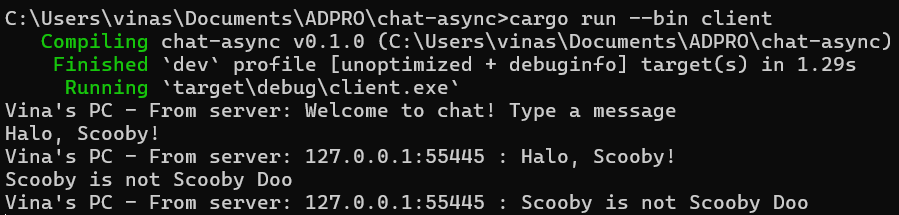

# Tutorial 10 (BROADCAST)
Nama: Vina Myrnauli Abigail Siallagan 
NPM: 2206825776 
Kelas: Pemrograman Lanjut - A 

---
## REFLEKSI 2

###### 2.1. Original code of broadcast chat.
  

* Server dijalankan dengan perintah `cargo run --bin server`. Setiap klien dijalankan dengan perintah `cargo run --bin client`.
* Setiap klien dan server menerima *broadcast* dari setiap klien lainnya. Ketika klien mengetikkan pesan di baris perintah, *string* tersebut akan dikirimkan ke server.
* Server akan meneruskan pesan tersebut ke semua klien yang terhubung kepadanya. Dengan begitu, setiap klien akan menerima pesan dari klien lainnya melalui server. Semua pesan yang diketikkan oleh klien akan disebarkan kepada semua klien yang terhubung ke server.
 

###### 2.2. Modifying the websocket port.
  

* Ketika port yang digunakan oleh klien dan server adalah sama, aplikasi akan tetap berjalan dengan baik seperti sebelumnya, seperti yang ditunjukkan dalam gambar di atas.

  

* Jika misalnya hanya satu dari port tersebut yang diubah, seperti port klien, maka akan terjadi kesalahan pada sisi klien karena menurut klien, port tersebut tidak terhubung dan program akan mengalami kegagalan ketika perintah `cargon run --bin client` dijalankan sepertipada gambar di atas.
 

###### 2.3. Small changes. Add some information to client.

* Tampilan yang terlihat dalam foto di atas berhasil dicapai dengan melakukan perubahan kode dalam bin/server.rs menjadi seperti berikut.

* Perubahan dilakukan untuk memastikan bahwa ketika `bcast.tx` (yang bertindak sebagai *sender*) mengirimkan pesan kepada setiap klien, ia juga akan menyediakan alamat IP *sender* dari teks melalui variabel addr.

